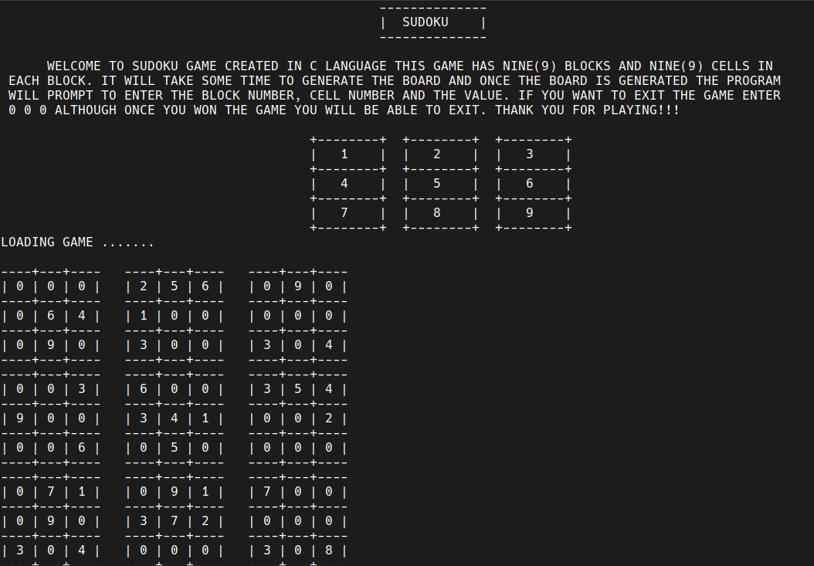
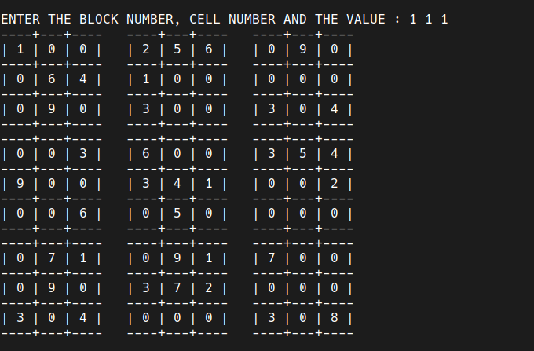
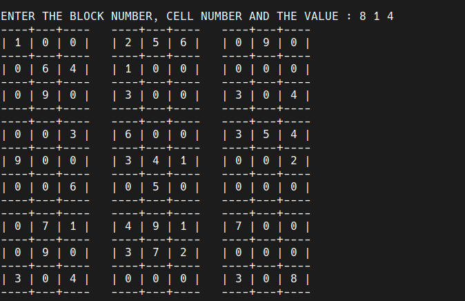
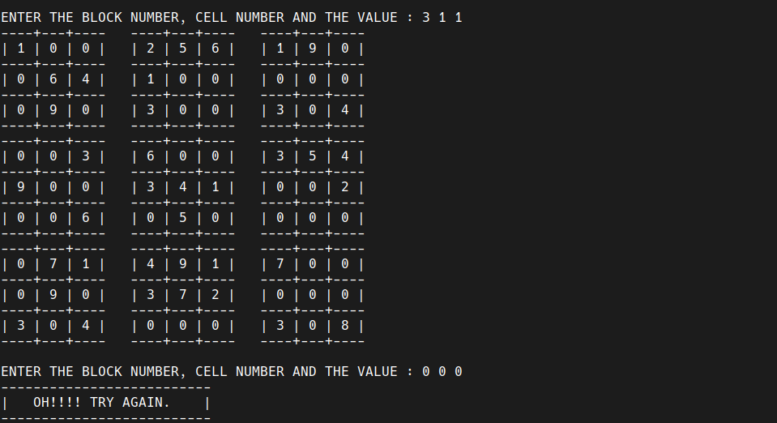

# SUDOKU

Welcome to SUDOKU game created in C Language this game has nine(9) blocks and nine(9) cells in each block. it will take some time to generate the board and once the board is generated the program will prompt to enter the block number, cell number and the value. if you want to exit the game enter 0 0 0 although once you won the game you will be able to exit. thank you for playing!!!

## TODO'S

At this stage there are a lot of bugs so main priority is to reduce them and also i will try and convert it to GUI.

## OUTPUT

This are some output images of the game.

