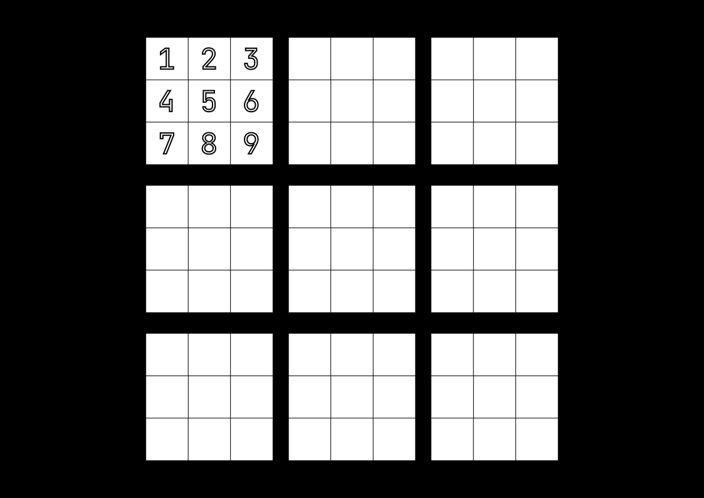
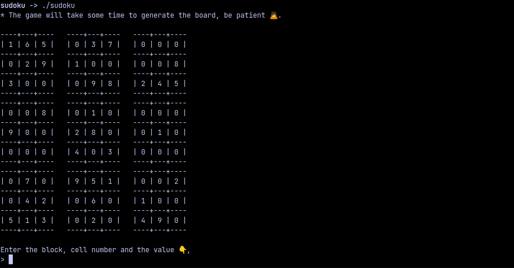
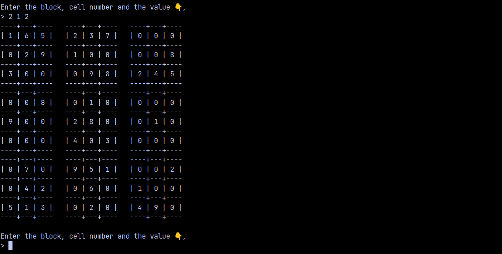
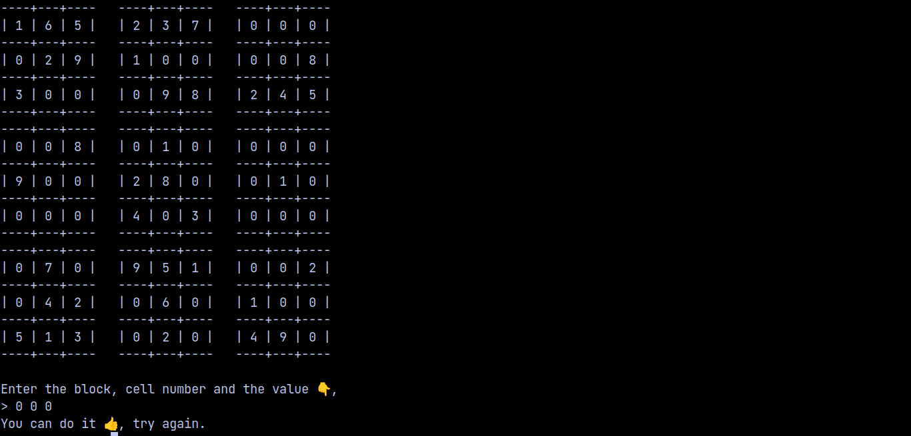

# Sudoku

This is the `Sudoku` game created in **c** language.

---

## How to play?

In this game there are 9 blocks and each block has 9 cells.

So you need to enter the input in this format,

`Enter the block, cell number and the value 👇,`

`> 1 1 1`

Here the block number is **_1_**, cell number is **_1_** and the value to be inserted is also **_1_**.

---

## Output

The program will take approximately 3 minutes 🕒, to generate the board.This is how the generated board will look like, it takes this much time due to `random number generator` in **c**.

`Enter the block, cell number and the value 👇,`

`> 2 1 2`

Here the block number is **_2_**, cell number is **_1_** and the value to be inserted is also **_2_**.

To exit the game 🗙,

`Enter the block, cell number and the value 👇,`

`> 0 0 0`

